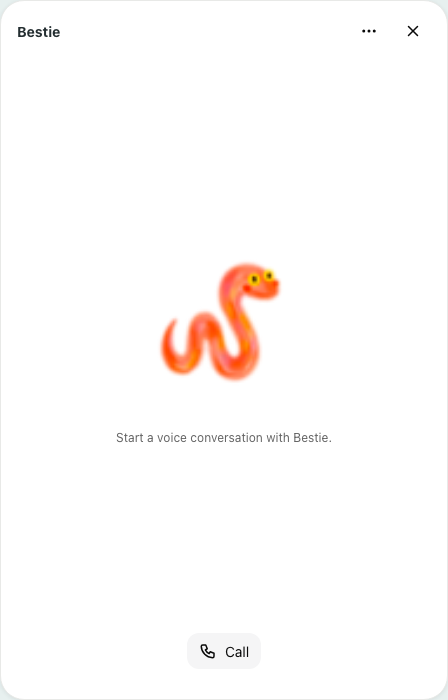
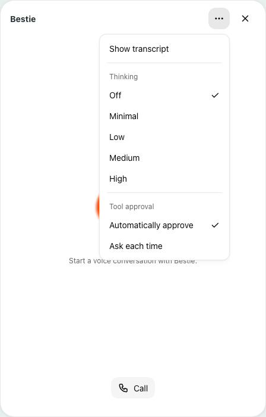
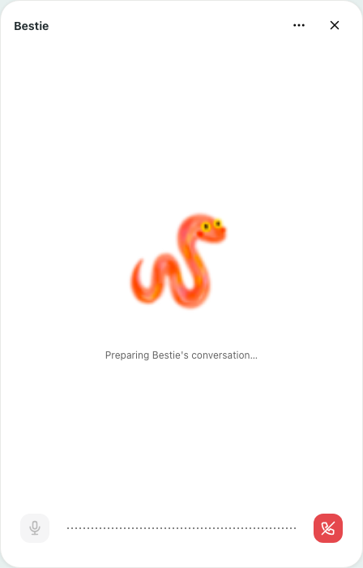
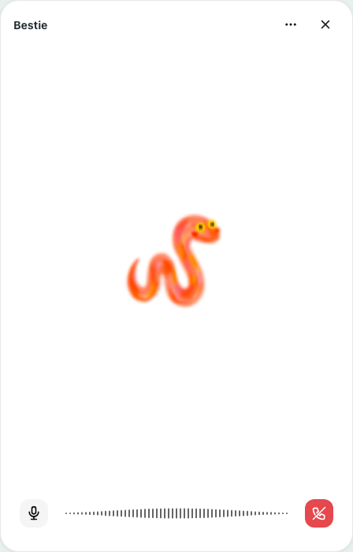
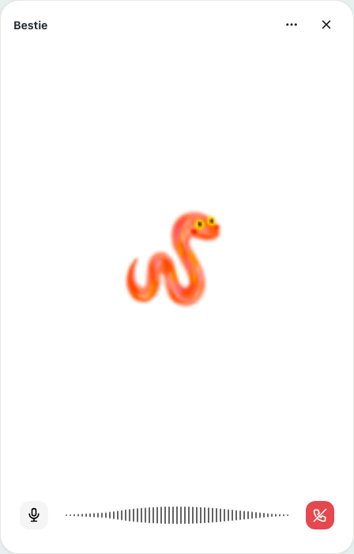
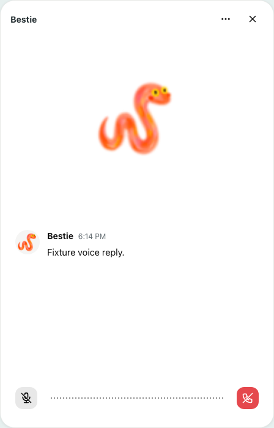
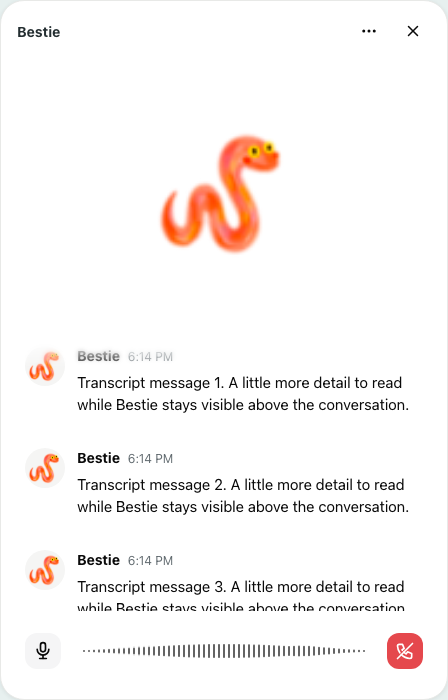
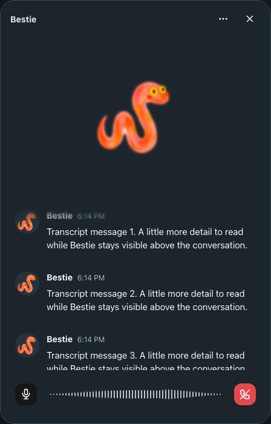
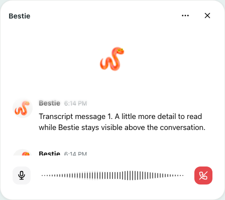

# Bestie voice review screenshots

Captured from the real Bestie components in Chromium using isolated identities, synthetic audio, and fixture transcript text. These are UI states, not recordings of a live model conversation.

## idle



## settings



## connecting



## listening



## speaking



## muted



## transcript



## transcript-dark



## transcript-compact



Reproduce with:

```sh
BESTIE_REVIEW_SCREENSHOTS=1 bin/pnpm exec playwright test --config tests/browser/playwright.config.mjs bestie.spec.mjs --project chromium --project webkit --no-deps
```

Captures are written under `test-results/browser/`.
