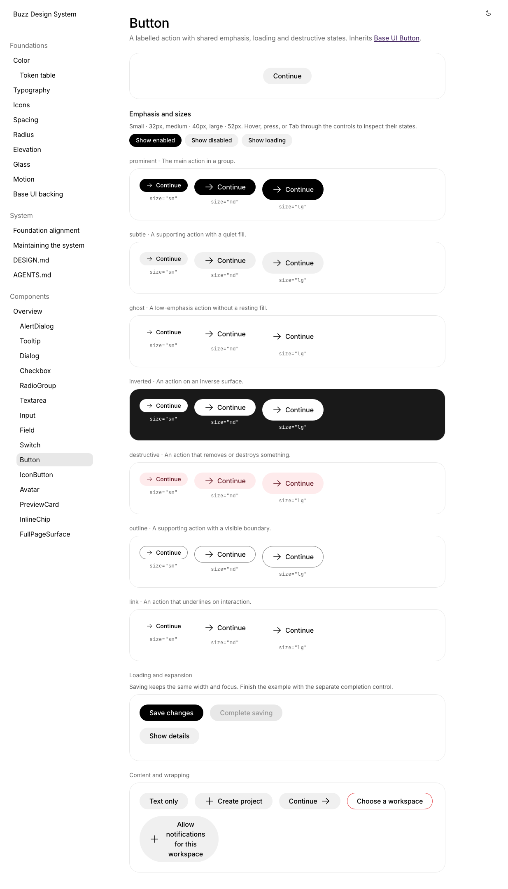
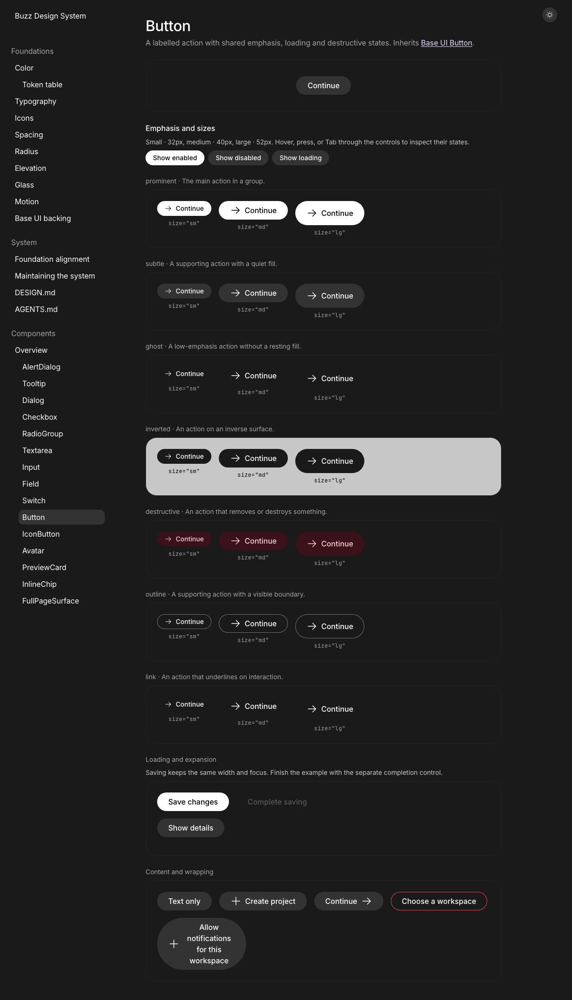
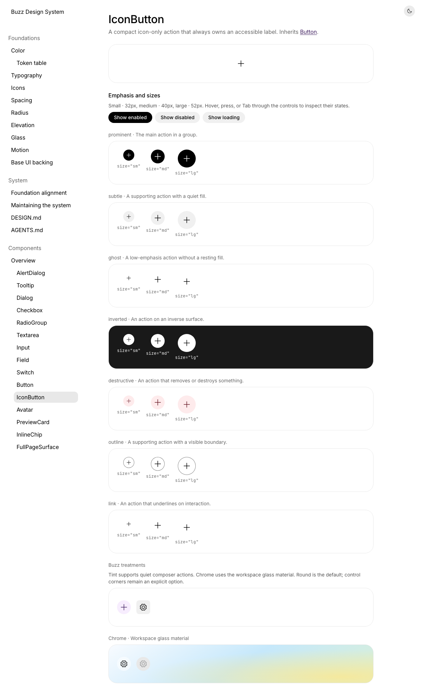
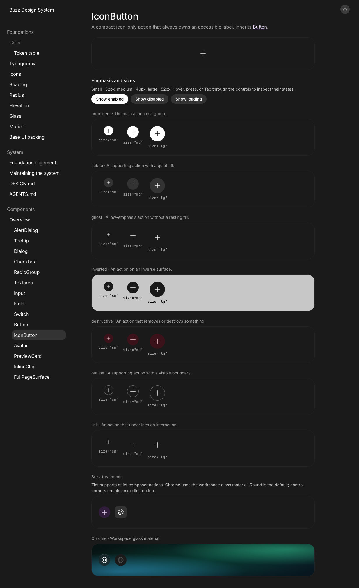
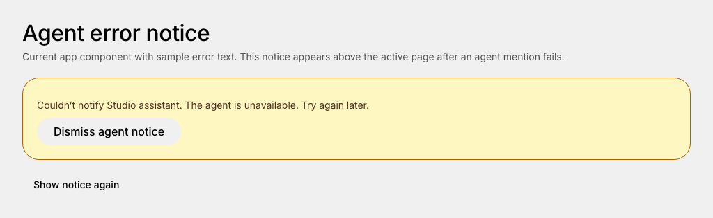

# Button review screenshots

Captured from the real shared components in the design-system viewer at a 1234 × 1324 viewport and default text scale. Full-page captures show the size and emphasis matrix, wrapping, and Buzz-specific icon treatments. Colors, typography, spacing, and materials use existing Buzz tokens.

The agent-notice capture uses the production `AgentWakeNotice` component with sample error text and a local dismiss/reopen control; it does not represent a live agent failure.

| Component | Light | Dark |
| --- | --- | --- |
| Button | [Full screenshot](button-light.png) | [Full screenshot](button-dark.png) |
| IconButton | [Full screenshot](icon-button-light.png) | [Full screenshot](icon-button-dark.png) |

## Button

## IconButton

## Agent error notice

