# Dialog polish screenshots

Captured from the production-component dialog gallery on September 22, 2026.
Light theme, 100% text, default states with disclosures collapsed; 2× resolution.
Add a community shows the initial step. The gallery uses local fixture data.

[Run the interactive gallery](../../../tests/fixtures/dialog-gallery/README.md)
to inspect dark mode, enlarged text, narrow layouts, and expanded states.

## Search Buzz

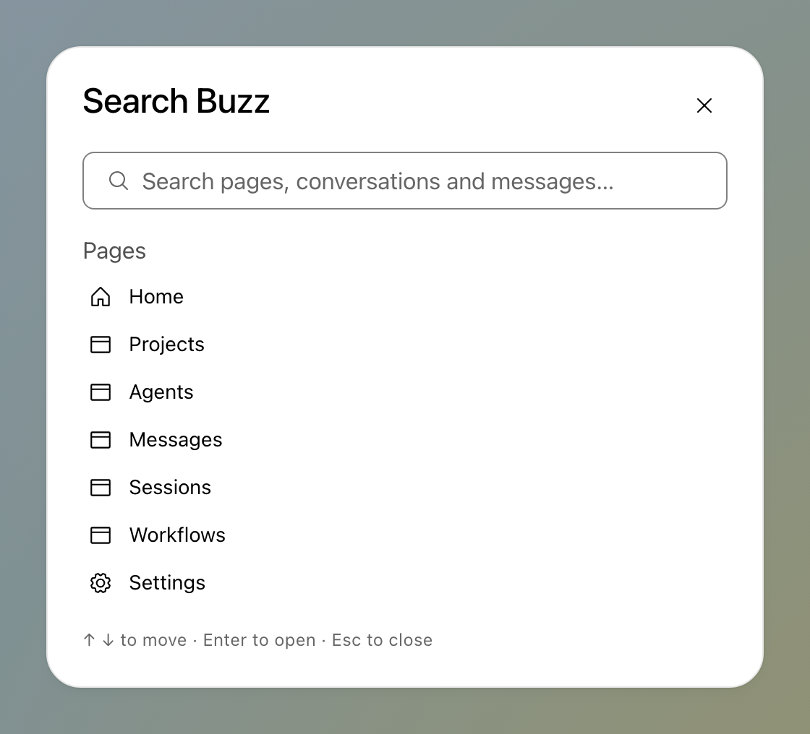

## Communities

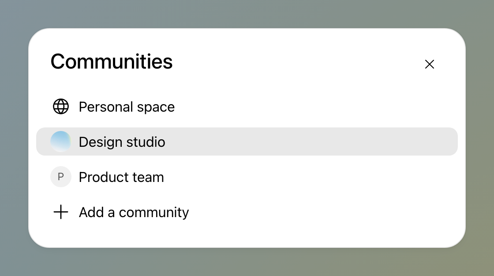

## Add a community

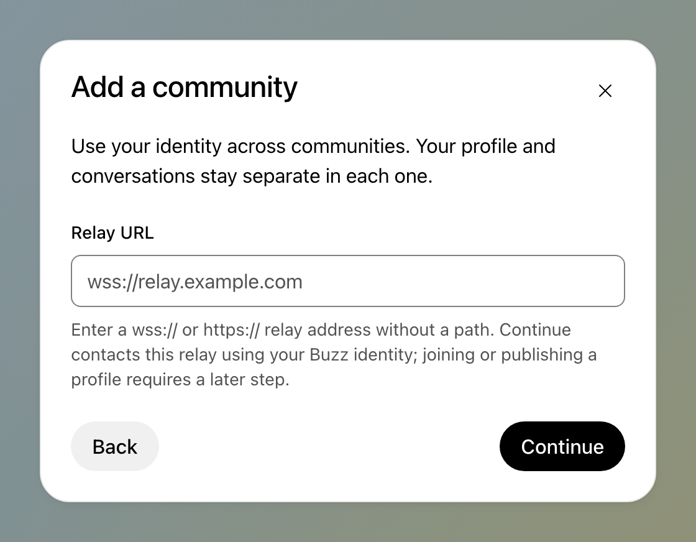

## Create agent

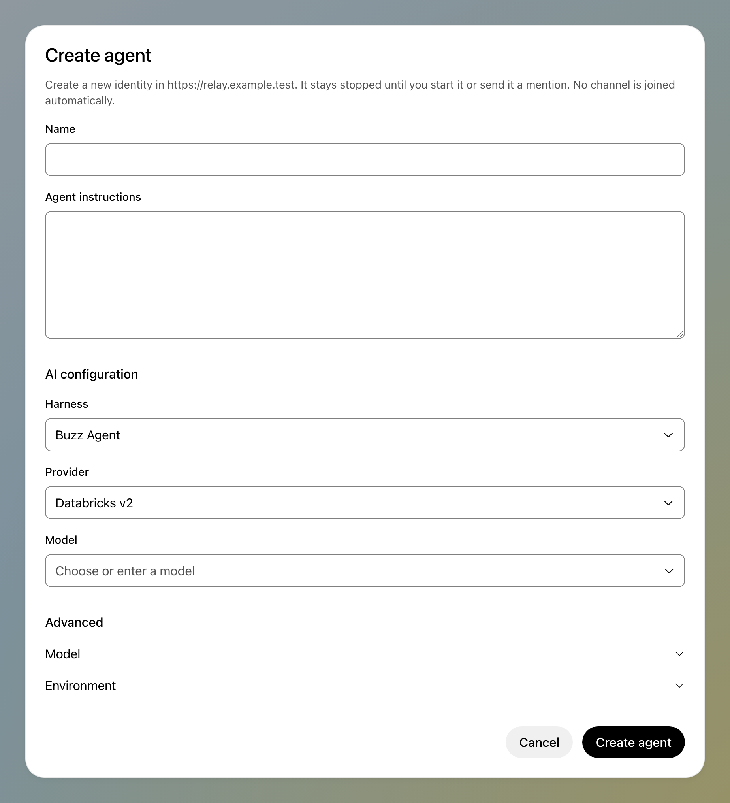

## Edit agent

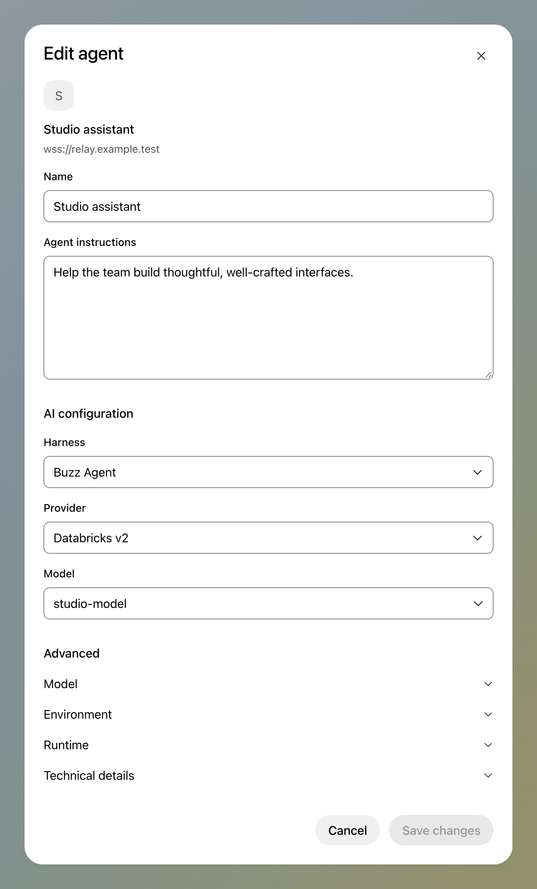

## Change workflow channel

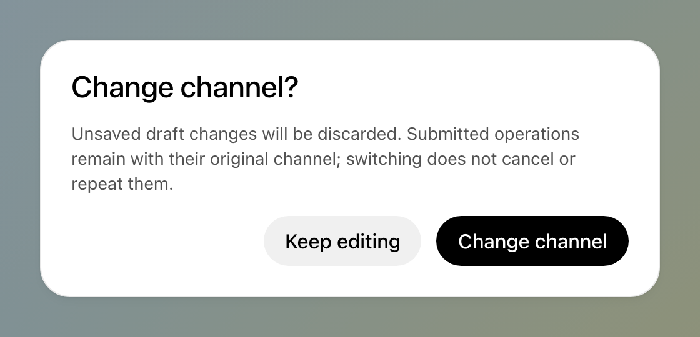

## Leave workflow draft

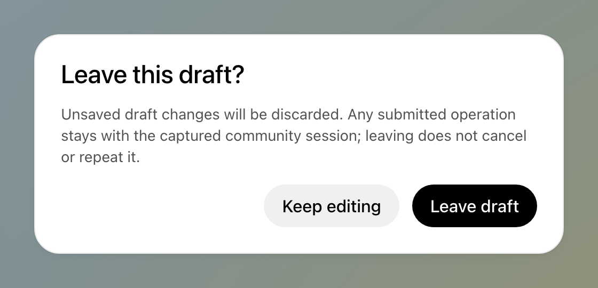

## Delete workflow

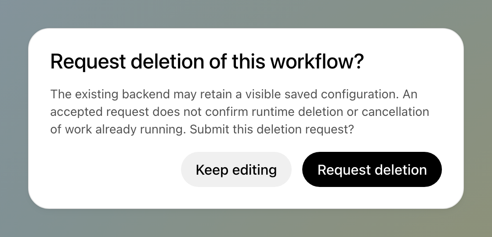

## Enable workflow

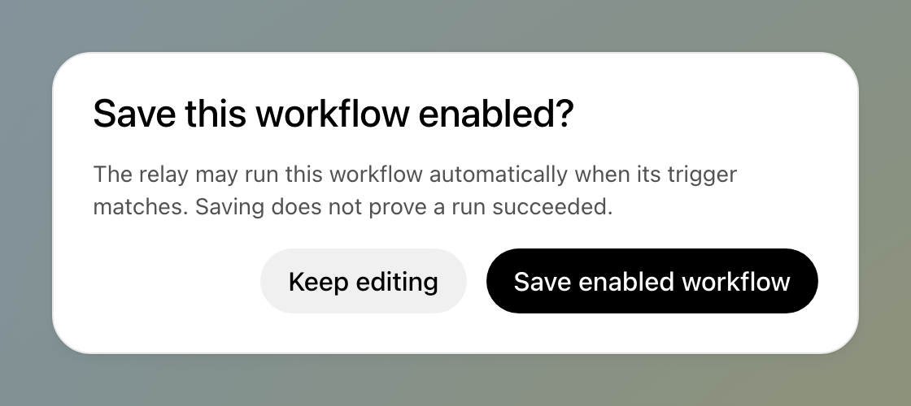

## Dismiss operation notice

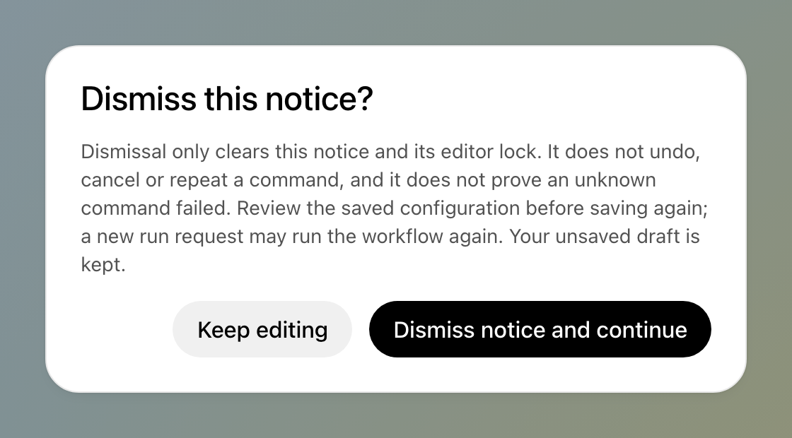

## Attachment fullscreen

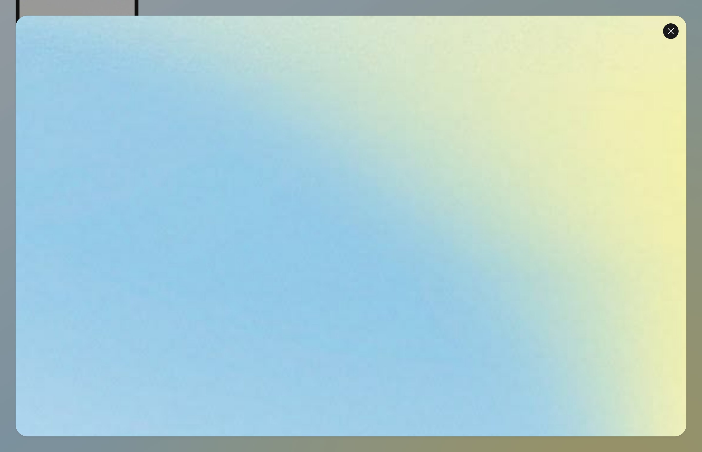

## Media review

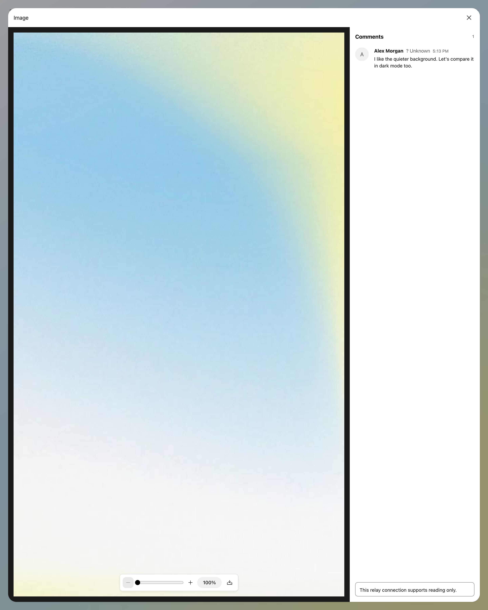
