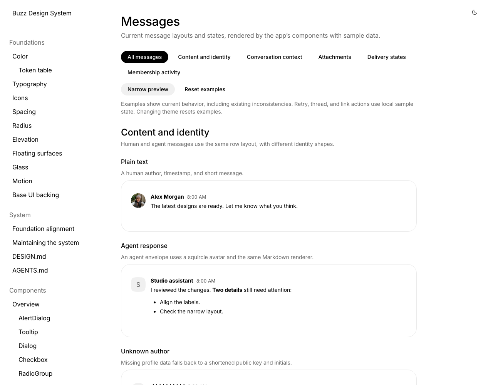
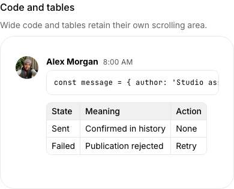
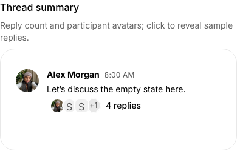

# Message gallery and spacing review

Captured from the Messages page and its production-component fixture on 2026-09-23.
All identities, messages and attachments are local sample data. The gallery has
33 examples, category filters, a narrow preview, and resettable local interactions.

The shared message renderer now uses 40px author avatars with a 12px content gap,
8px table corners with a complete outer border, 4px thread-button leading padding,
4px participant overlap with 1.5px separating rings, and a 12px membership gap.

| Category | Light | Dark |
| --- | --- | --- |
| Content and identity | [View](content-light.png) | [View](content-dark.png) |
| Conversation context | [View](conversation-light.png) | [View](conversation-dark.png) |
| Attachments | [View](attachments-light.png) | [View](attachments-dark.png) |
| Delivery states | [View](delivery-light.png) | [View](delivery-dark.png) |
| Membership activity | [View](activity-light.png) | [View](activity-dark.png) |

Category captures use a 900px viewport. The following specimens use the gallery's
390px narrow preview; the documentation overview uses a 1280 × 1000 viewport.

Run `just design`, then open **Product patterns → Messages** to try the examples.
Audio/voice-note specimens, composer, presence, unread tracking, history loading,
and live relay/plugin behavior remain outside this gallery pass.
