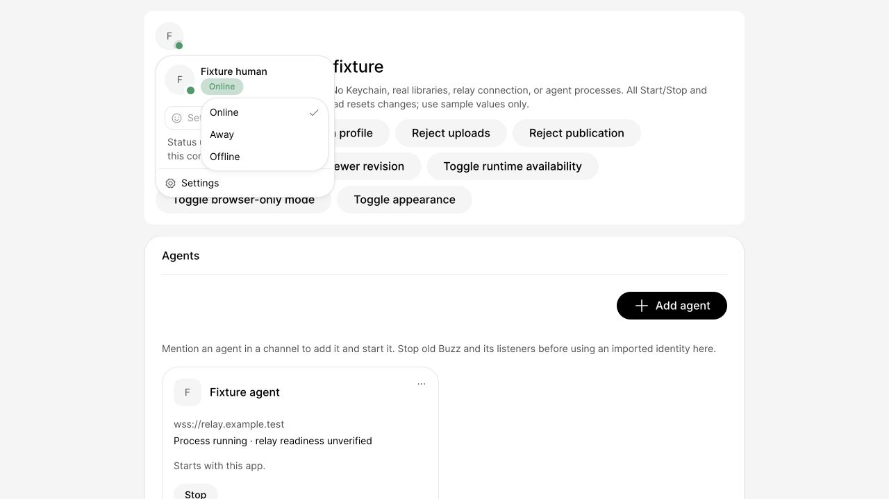
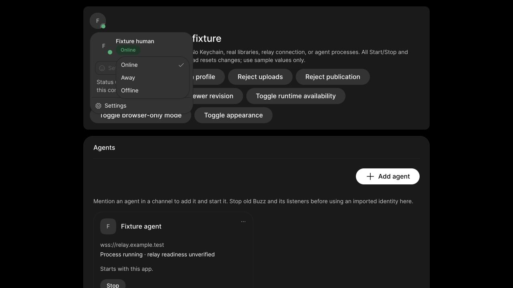

# Presence label review snapshots

These snapshots show the production profile menu in the isolated
`/tests/fixtures/agent-control.html?avatars` preview, using sample identities.
The availability capsule uses Medium (500), 12px type and a 16px line height.
Dropdown choices remain Regular (400): Online, Away, and Offline.

| Light | Dark |
| --- | --- |
|  |  |

The preview uses Green 10 for Online, Amber 10 for the Away dot and translucent
fill, and Amber 12 for Away text. Online and Offline backgrounds mix over the
inset surface. Saved/default automatic behavior remains internal.

These are browser snapshots, not native or live-account validation. The user
approved the Medium label treatment. They do not establish contrast compliance:
Online label text still fails AA in light mode and APCA in both modes; the
light-mode Amber 10 dot is below the non-text target. These are explicitly
accepted design exceptions. See the measured ratios and exception scope in
[presence documentation](../../presence.md#your-status).
