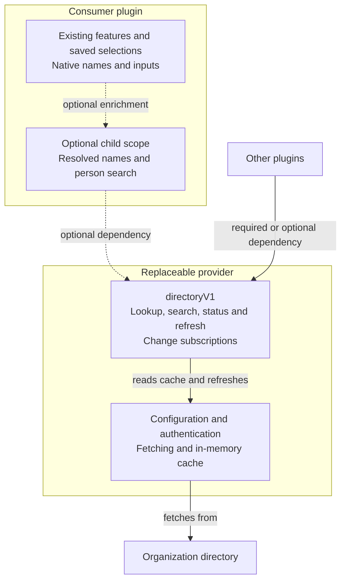

# Shared directory service

Status: Draft v0.1 — seeking direction feedback, not line edits.

## Problem

Any plugin that displays, references or selects a person can need two capabilities:

- **Identity resolution:** given an account identifier from another system,
  identify the person and their display name.
- **Person discovery:** given a name or search query, find people and the account
  identifiers the plugin can use for them.

Examples include displaying an owner, selecting an assignee or choosing a message
recipient. Each plugin owns what it does with the selected person; it should not
also need its own directory integration, credentials, indexing and cache. Buzz’s
existing profile and identity-naming services resolve Nostr identities; they do
not provide organizational person search or external-account mappings.

## Chosen approach

The Directory plugin provides person discovery and identity resolution through
`directoryV1`, owning configuration, authentication, fetching and caching.
Consumers use the shared API while retaining ownership of their features and
saved selections. A plugin that can operate without Directory uses an optional
child `ctx.inject(["directoryV1"], …)` scope and falls back to its existing names
and inputs; a plugin that requires it declares `directoryV1` in top-level `inject`.
Organizations replace the provider plugin while preserving the consumer contract;
Buzz needs no additional runtime service registry.

The example below applies these capabilities to a review tool; the service does
not own review queues, assignments or messaging. Organization charts, directory
writes, multiple simultaneous providers and changes to Nostr naming are out of
scope. This PR is documentation only; all API names and implementation work below
are proposed.



The service belongs to the active provider plugin. Replacing that plugin preserves
the API used by consumers. Disabling it stops the optional child scope; the
consumer’s existing features and saved selections remain available. Required
consumers follow the existing activation wait and timeout described below.

## Existing support [sketch]

- [Plugin runtime](../src/plugins/runtime.ts) forwards `module.inject` to Cordis.
  The pinned fork treats every declared dependency as required; object values are
  intercept configuration, not optional-dependency metadata. A missing required
  service leaves the plugin starting until Buzz’s activation timeout fails it.
- `ctx.inject(dependencies, callback)` creates a child scope that starts when its
  dependencies appear and stops when they disappear. Keeping Directory out of
  an optional consumer’s top-level dependencies lets the rest of the plugin stay
  active.
- `ctx.provide(name, implementation)` registers a service for the provider’s
  scope. Cordis rejects a second live registration and removes it on disposal.
- [Identity Naming](../src/bundled/identity-naming/index.ts) registers a Nostr
  naming policy with `identityNames`; it is separate from this person directory.
- [PluginManifest](../src/plugins/api.ts) has `id`, `name` and `apiVersion: 1`.
  It does not declare network origins or host commands. Provider authentication
  and transport must be checked against the intended host before implementation.

Standalone assertions against pinned Cordis verified provider plugins appearing,
disappearing, being replaced and being disposed at shutdown, with the consumer’s
parent starting once. These verify the dependency mechanism only, not the proposed
API or authenticated Buzz behavior.

## Service and identity contract [deep]

The identity shape, account namespaces and service name need agreement before
independently distributed plugins adopt them. The shared contract contains types
only; consumers do not import the provider’s implementation.

```ts
export type DirectoryPerson = Readonly<{
  id: string;
  displayName: string;
  accounts: Readonly<Record<string, string>>;
}>;

export type DirectoryStatus = Readonly<{
  state: "unconfigured" | "loading" | "ready" | "failed";
  failure?: string;
  loadedAt?: number;
}>;

export interface DirectoryV1 {
  lookup(namespace: string, account: string): DirectoryPerson | undefined;
  search(query: string, limit: number): readonly DirectoryPerson[];
  status(): DirectoryStatus;
  refresh(): Promise<void>;
  snapshot(): number;
  subscribe(listener: () => void): () => void;
}
```

`id` is opaque and unique within one provider and authorization context;
replacement may change it. `displayName` is presentation only. Consumers persist
the external account they already understand, not a person id or display name.
The directory supplies identity information; the consumer decides which external
account is meaningful for its action and preserves its existing storage format.

An account namespace identifies its authority and identifier kind. The initial
v1 mapping is `github.com/login`, with case-insensitive lookup. GitHub Enterprise
accounts belong to a different authority and cannot be treated as public GitHub
accounts. Unknown namespaces return no match; additional namespaces require an
explicit contract addition. This limits the initial implementation, not the
person-discovery and identity-resolution responsibilities of the service.
Providers return account identifiers and display names as supplied by the source.

Lookup and search synchronously read the provider’s current indexed snapshot;
neither starts a network request. Missing or conflicting mappings return no match.
Search trims queries and matches directory names and account logins without case
sensitivity. Empty queries return no results; results have a stable order for the
same query and snapshot. Initially cap results at 20, clamp positive integer
limits to that cap, and reject other limits. Start without debounce and measure
input latency before adding it. Consumers call constant-time `lookup` per item;
there is no additional batch method.

`snapshot()` is a stable revision until data or status changes; `subscribe`
notifies after either changes and returns an unsubscribe function. `loadedAt` is
epoch milliseconds for the last successful load, absent before the first success.
`failure` is sanitized user-facing text, never raw responses or credentials.
The provider publishes its service before starting the initial fetch, so loading
data does not delay plugin activation.

The service name carries the contract version. A v2-only provider is unavailable
to a consumer requesting `directoryV1`; breaking changes require a new name and
continued v1 support during migration. `apiVersion: 1` does not negotiate service
features. Proposed default: distribute a shared type-only contract with the
Directory plugin’s authoring files; confirm its durable location before coding.

## Optional lifecycle and provider replacement [deep]

Illustrative consumer wiring, retaining the plugin’s required services:

```ts
export const inject = ["react", "pages"];
export function apply(ctx: Context) {
  registerPluginPage(ctx);
  ctx.inject(["directoryV1"], (scope) => {
    attachDirectory(scope, scope.directoryV1);
  });
}
```

`attachDirectory` subscribes to the service and uses `scope.effect` cleanup to
unsubscribe and clear displayed directory names and search results. Lookup and
search are synchronous; no separate asynchronous consumer lookup lifecycle is
needed. The consumer’s own requests, feature state and saved selections remain
owned by its parent scope.

| Directory state | Optional consumer behavior |
| --- | --- |
| Absent, disabled, incompatible version or activation failure | Existing names and inputs; no persistent directory error. |
| Present, unconfigured or initial load pending | Same fallback; Directory’s settings own configuration/loading status. |
| Ready | Resolved names and person search for the consumer’s features. |
| Initial fetch failed | Existing names and inputs; Directory reports the error and offers refresh. |
| Refresh failed with cached data | Retain cached names for the same authorization context; expose failure/freshness without blocking the consumer’s existing features. |
| Disabled or replaced after use | Clear directory-derived UI immediately; keep feature state and saved selections. |

Enable Directory later and the child scope starts without remounting the consumer.
For replacement, disable the old provider, await its disposal, then enable the new
one. Cordis rejects overlapping registrations: the existing provider keeps serving
and the new plugin fails activation visibly in Settings → Plugins. A disposal
timeout does not authorize overlapping providers. Required consumers follow the
existing activation-timeout/reload behavior; this proposal adds no retry policy.

## Fetching, credentials and cache [deep]

Directory owns fetching and authenticates independently of its consumers. No token
passes through `DirectoryV1`. Use the existing host authentication and transport
capabilities where available; resolve the actual mechanism before enabling real
organization data. Plugins are trusted same-process code; injection is not an
access-control mechanism.

Initial defaults: an in-memory snapshot, 24-hour freshness, explicit refresh after
failure and a 20-second request deadline.
Concurrent refresh calls share one request. Expected fetch failures update status
and settle `refresh()` without rejection; subscribers observe the new status.
Successful empty data replaces the old snapshot; a failed refresh retains it only
within the same authorization context. Refresh cadence and indexing details stay
inside Directory, shared by every consumer.

Scope the cache to the Buzz profile, directory account and source configuration.
Disposal, reload, credential replacement or a scope change clears cached entries,
increments a request generation and aborts outstanding fetches. Discard late
responses from an earlier generation, even if abort was ignored; an invalidated
refresh settles without publishing. Never reuse one account’s cache for another.
An independently authenticated consumer also clears transient names/search on its
own disconnect or account change without clearing the provider cache used by others.

Persist no directory records in host preferences, relay events or consumer state.
Configuration and credential storage follow the approved provider/host mechanism.
Consumers escape display names and never use names or mappings for authorization.
Directory diagnostics contain counts/status, not person records or credentials.

## Example and edge cases [sketch]

For example, a pull-request review plugin can resolve author names and let users
choose priority accounts (VIPs). A queue row calls
`lookup("github.com/login", authorLogin)` and shows the returned
name or the GitHub login. The panel subscribes once, so a completed refresh updates
names without refetching GitHub. In the VIP picker, a user searches a directory
username, explicitly selects a result, and the review plugin saves its GitHub
login in its existing VIP list. The directory owns neither that list nor its
meaning. Reloading or disabling Directory leaves the saved account usable; manual
GitHub entry remains available without person search.

1. **Ambiguous query versus conflicting mapping.** Several valid people may match
   a query; show their account logins and require explicit selection. If one
   account maps to several people, or one person maps to multiple accounts in
   this namespace, omit the conflicting mappings from lookup and selectable
   search results. This initial contract requires 1:1 mappings. Never infer the
   chosen person from a display name. Count omissions in Directory diagnostics;
   no public omission-count field initially.
2. **Disable or change credentials during refresh.** Clear the relevant cached
   and displayed data, cancel the request and reject its late result. After a
   provider swap the consumer subscribes only to the replacement. GitHub queues,
   manual VIP entry and previously saved VIPs continue to work.

## Delivery and verification [sketch]

1. Agree the contract and authentication mechanism, then implement Directory with
   its configuration UI and the first consumer’s integration in coordinated PRs.
   Keep service types with their first implementation and consumer; no unused
   host registry or alternate provider implementation is required.
2. Deploy Directory before switching a consumer to the shared API. If it has local
   directory fetching, caching and configuration, remove them; only one directory
   implementation should execute per plugin version. Preserve the consumer’s
   saved selections and feature-specific settings. Other plugins adopt the API
   when needed.
3. Verify the provider and the first consumer together in an authenticated desktop
   host. Disable Directory to verify fallback. Roll back the consumer migration
   independently if needed; saved selections require no conversion.

Colocated provider tests cover search/identity conflicts, empty data, initial and
refresh failures, shared refreshes, credential isolation and late-response
rejection. Consumer component tests cover explicit person selection, preference
preservation, fallback and clearing stale displayed data. Host integration tests
exercise actual plugin injection, duplicate-provider failure, enable/disable and
replacement without restarting the consumer’s main scope. Control request
completion with deferred operations. A focused desktop check verifies authentication,
configuration and person selection; implementation and these checks remain
future work, not validation supplied by this documentation PR.

## Alternative considered

Add a host-owned directory registry similar to the
[identityNames service](../src/features/identity-names/service.ts). Rejected:
Cordis already supplies registration and disposal; another host owner and provider
selection policy are unnecessary for one active provider.

## Open questions

Dates are proposed decision deadlines, not delivery commitments.

1. Where should independently built plugins obtain the shared type-only contract?
   Default: Directory’s authoring files. Re-exporting from `@buzz/author` requires
   explicit approval for its FOUNDATION contract. **Owner:** Buzz plugin API
   maintainer. **Needed:** 2026-10-02, before implementation.
2. Which host authentication/transport capability will the Directory plugin use?
   Confirm compatibility with the intended host; do not assume a consumer’s token
   becomes available to Directory. **Owner:** Directory maintainer and Buzz host
   maintainer. **Needed:** 2026-10-02, before implementation.
3. What is measured search latency at the supported directory size? Keep the
   20-result cap and immediate local search unless measurements warrant change.
   **Owner:** Directory maintainer. **Needed:** 2026-10-09, before rollout.
4. Where is the organization-specific provider distributed and who maintains it?
   Default: independently installed plugin; no private configuration in Buzz’s
   public bundled catalog. **Owner:** Directory maintainer. **Needed:** 2026-10-09,
   before rollout.

## Reversibility

| Decision | Classification | Cost if wrong |
| --- | --- | --- |
| Provider-scoped person ids; authority-scoped accounts; existing consumer storage formats | One-way | Changing identity semantics requires coordinated provider/consumer changes and possibly preference migration. |
| Versioned `directoryV1` contract | One-way | Changing existing behavior breaks independently released consumers; introduce a new version. |
| Plugin owns service registration, configuration, fetching and cache | Two-way | Ownership can move later while preserving the consumer contract. |
| Optional consumer uses a child scope | Two-way | Local consumer wiring change; required dependency would remove fallback. |
| One active provider, using Cordis duplicate rejection | Two-way | Multiple-provider selection needs a separate future design. |
| Indexed lookup; 20 search results; no debounce initially | Two-way | Adjust provider internals/defaults after measuring; preserve the API contract. |
| 24-hour freshness; explicit retry; 20-second deadline | Two-way | Provider policy changes, no consumer migration. |
| In-memory cache and shared type-only authoring files | Two-way | Persistence or packaging can change separately; each needs its own compatibility review. |
