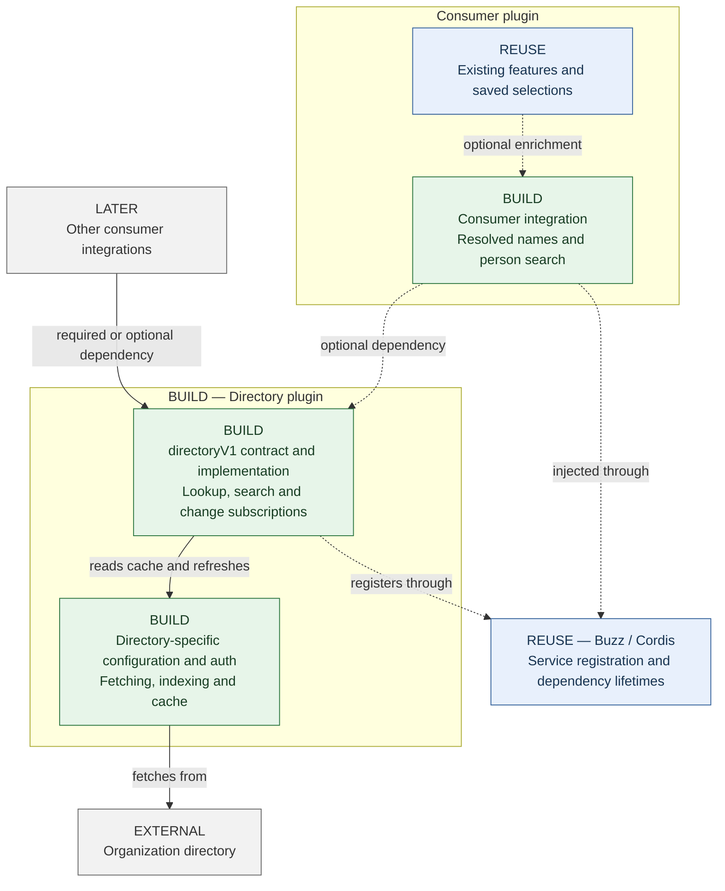

# Shared directory service

Status: Draft v0.1 — seeking direction feedback, not line edits.

## Problem

Any plugin that displays, references or selects a person can need two capabilities:

- **Identity resolution:** given an account identifier from another system,
  identify the person and their display name.
- **Person discovery:** given a name or search query, find people and the account
  identifiers the plugin can use for them.

Examples include displaying an owner, selecting an assignee or choosing a message
recipient. Each plugin owns what it does with the selected person; it should not
also need its own directory integration, credentials, indexing and cache. Buzz’s
existing profile and identity-naming services resolve Nostr identities; they do
not provide organizational person search or external-account mappings.

## Chosen approach

The Directory plugin provides person discovery and identity resolution through
`directoryV1`, owning configuration, authentication, fetching and caching.
Consumers use the shared API while retaining ownership of their features and
saved selections. A plugin that can operate without Directory uses an optional
child `ctx.inject(["directoryV1"], …)` scope and falls back to its existing names
and inputs; a plugin that requires it declares `directoryV1` in top-level `inject`.
Organizations replace the provider plugin while preserving the consumer contract;
Buzz needs no additional runtime service registry.

The example below applies these capabilities to a review tool; the service does
not own review queues, assignments or messaging. Organization charts, directory
writes, multiple simultaneous providers and changes to Nostr naming are out of
scope. This PR is documentation only; all API names and implementation work below
are proposed.

**Implementation scope:** build the Directory provider and its consumer integration;
reuse Buzz's plugin infrastructure in place. **No built-in Buzz service is proposed
for extraction.** In the diagram, **BUILD** means new code, **REUSE** means existing
code that stays with its current owner, **EXTERNAL** means outside this project,
and **LATER** means outside the first delivery.


```mermaid
flowchart TB
  source["EXTERNAL<br/>Organization directory"]

  subgraph provider["BUILD — Directory plugin"]
    providerData["BUILD<br/>Directory-specific configuration and auth<br/>Fetching, indexing and cache"]
    service["BUILD<br/>directoryV1 contract and implementation<br/>Lookup, search and change subscriptions"]
    service -->|reads cache and refreshes| providerData
  end
  providerData -->|fetches from| source

  subgraph consumerPlugin["Consumer plugin"]
    core["REUSE<br/>Existing features and saved selections"]
    enrichment["BUILD<br/>Consumer integration<br/>Resolved names and person search"]
    core -.->|optional enrichment| enrichment
  end
  enrichment -.->|optional dependency| service
  consumers["LATER<br/>Other consumer integrations"] -->|required or optional dependency| service
  runtime["REUSE — Buzz / Cordis<br/>Service registration and dependency lifetimes"]
  service -.->|registers through| runtime
  enrichment -.->|injected through| runtime

  classDef build fill:#e7f5e9,stroke:#28733d,color:#183d23
  classDef reuse fill:#e8f0fc,stroke:#315f99,color:#183451
  classDef outside fill:#f2f2f2,stroke:#666,color:#333
  class providerData,service,enrichment build
  class core,runtime reuse
  class source,consumers outside
```

The service belongs to the active provider plugin. Replacing that plugin preserves
the API used by consumers. Disabling it stops the optional child scope; the
consumer’s existing features and saved selections remain available. Required
consumers follow the existing activation wait and timeout described below.

| Area | Proposed work | Existing code reused or retained |
| --- | --- | --- |
| Directory provider and `directoryV1` | **Build** the shared contract, person search/account index, cache and provider lifecycle. | Register the service through existing Cordis APIs; no new host registry. |
| Provider configuration and authentication | **Build** packaged source settings, credential-command integration and a status/refresh card. | Reuse [settings-card registration](../src/features/settings/service.ts) and the existing desktop host commands/requests described below. Credentials stay in memory; no new credential store or HTTP subsystem. |
| Consumer integration | **Build** lookup/search UI wiring and dependency-scoped cleanup for the first consumer. | Keep the consumer's features, saved selections and fallback inputs in that plugin. Other integrations follow only when needed. |
| Buzz plugin infrastructure | **Reuse in place.** | [Plugin runtime](../src/plugins/runtime.ts), Cordis registration/injection/disposal, and plugin installation remain host-owned. |
| Built-in Nostr identities | **Retain in Buzz; do not extract or wrap as `directoryV1`.** | [Profile directory](../src/features/relay/profile-directory.ts) and [identity naming](../src/features/identity-names/service.ts) keep their Nostr/community responsibilities. |
| Organization directory | **External dependency.** | Connect to an existing data source; do not build a directory server. |

Moving a consumer's existing directory-specific fetch/cache code into the provider,
if present, is plugin-local migration. It is not an extraction of Buzz's built-in
profile or identity services. The new abstraction describes organizational people
and external accounts; those existing services retain their current contracts.

## Existing support [sketch]

Checked against public `main` on 2026-09-29; the host API source links identify
the checked revision.

- [Plugin runtime](../src/plugins/runtime.ts) forwards `module.inject` to Cordis.
  The pinned fork treats every declared dependency as required; object values are
  intercept configuration, not optional-dependency metadata. A missing required
  service leaves the plugin starting until Buzz’s activation timeout fails it.
- `ctx.inject(dependencies, callback)` creates a child scope that starts when its
  dependencies appear and stops when they disappear. Keeping Directory out of
  an optional consumer’s top-level dependencies lets the rest of the plugin stay
  active.
- `ctx.provide(name, implementation)` registers a service for the provider’s
  scope. Cordis rejects a second live registration and removes it on disposal.
- [Identity Naming](../src/bundled/identity-naming/index.ts) registers a Nostr
  naming policy with `identityNames`; it is separate from this person directory.
- The current [PluginManifest](https://github.com/block/buzz-app/blob/14a2e7ed585b130315629ded39d1b83b05eb2a53/src/plugins/api.ts)
  supports `host.commands` and `host.networkOrigins`. The existing
  [host service](https://github.com/block/buzz-app/blob/14a2e7ed585b130315629ded39d1b83b05eb2a53/src/features/host/service.ts)
  provides `ctx.host.runCommand` and `ctx.host.request` to installed desktop
  plugins. Reuse these operations with Directory's own declarations; the host
  does not provide a shared credential store or another plugin's credentials.
  Browser transport is not supplied by this capability and is not added here.

Standalone assertions against pinned Cordis verified provider plugins appearing,
disappearing, being replaced and being disposed at shutdown, with the consumer’s
parent starting once. These verify the dependency mechanism only, not the proposed
API or authenticated Buzz behavior.

## Service and identity contract [deep]

The identity shape, account namespaces and service name need agreement before
independently distributed plugins adopt them. The shared contract contains types
only; consumers do not import the provider’s implementation.
The synchronous API below is provisional until source feasibility and search
latency are verified in open questions 2–3. Do not freeze or implement the contract
before those checks; a query-only source may require an asynchronous API instead.

```ts
export type DirectoryPerson = Readonly<{
  id: string;
  displayName: string;
  accounts: Readonly<Record<string, string>>;
}>;

export type DirectoryStatus = Readonly<{
  state: "unconfigured" | "loading" | "ready" | "failed";
  failure?: string;
  loadedAt?: number;
}>;

export interface DirectoryV1 {
  lookup(namespace: string, account: string): DirectoryPerson | undefined;
  search(
    query: string,
    limit: number,
    namespace?: string,
  ): readonly DirectoryPerson[];
  status(): DirectoryStatus;
  refresh(): Promise<void>;
  snapshot(): number;
  subscribe(listener: () => void): () => void;
}
```

`id` identifies a person in transient UI lists and selections. It is opaque and
unique within one provider and authorization context: the Buzz profile, directory
account and source configuration. Replacement may change it. `displayName` is
presentation only. Consumers persist the external account they already understand,
not a person id or display name.
The directory supplies identity information; the consumer decides which external
account is meaningful for its action and preserves its existing storage format.

An account namespace identifies its authority and identifier kind. The initial
v1 mapping is `github.com/login`, with case-insensitive lookup. GitHub Enterprise
accounts belong to a different authority and cannot be treated as public GitHub
accounts. Unknown namespaces return no match; additional namespaces require an
explicit contract addition. This limits the initial implementation, not the
person-discovery and identity-resolution responsibilities of the service.
Providers return account identifiers and display names as supplied by the source.
Consumers compare `github.com/login` selections case-insensitively with saved
accounts before adding them, preserving their existing storage format.

Lookup and search synchronously read the current indexed snapshot, including
while a refresh is loading or has failed; neither starts a network request.
Status describes the latest fetch, not permission to read cached data. Loading
keeps the last successful snapshot; before the first success it is empty.
Missing or conflicting mappings return no match.
Search trims queries and matches directory names and account logins without case
sensitivity. Empty queries return no results; results have a stable order for the
same query, namespace and snapshot. With `namespace`, include only people with an
unambiguous account in that namespace, filtering before the result limit. An
unknown namespace returns no results. Without it, return all matching people,
including those without an account the consumer can use; the consumer decides
whether they are selectable. The optional filter is part of the initial v1
contract; making it required later would be a breaking change.
`limit` is an upper bound, not a promised result count.
The initial provider caps results at 20 and clamps positive integer limits to
that cap; invalid limits throw `RangeError`. Start without debounce and measure
input latency before adding it. Consumers call constant-time `lookup` per item;
there is no additional batch method.

`snapshot()` is a stable revision until data or status changes; `subscribe`
notifies after either changes and returns an unsubscribe function. `loadedAt` is
epoch milliseconds for the last successful load, absent before the first success.
`failure` is sanitized user-facing text, never raw responses or credentials.
The provider publishes its service before starting the initial fetch, so loading
data does not delay plugin activation.

The service name carries the contract version. A v2-only provider is unavailable
to a consumer requesting `directoryV1`; breaking changes require a new name and
continued v1 support during migration. `apiVersion: 1` does not negotiate service
features. Proposed default: distribute a shared type-only contract with the
Directory plugin’s authoring files; confirm its durable location before coding.

## Optional lifecycle and provider replacement [deep]

Illustrative consumer wiring, retaining the plugin’s required services:

```ts
export const inject = ["react", "pages"];
export function apply(ctx: Context) {
  registerPluginPage(ctx);
  ctx.inject(["directoryV1"], (scope) => {
    attachDirectory(scope, scope.directoryV1);
  });
}
```

`attachDirectory` subscribes to the service and uses `scope.effect` cleanup to
unsubscribe and clear displayed directory names and search results. Lookup and
search are synchronous; no separate asynchronous consumer lookup lifecycle is
needed. The consumer’s own requests, feature state and saved selections remain
owned by its parent scope.

| Directory state | Optional consumer behavior |
| --- | --- |
| Absent, disabled, incompatible version or activation failure | Existing names and inputs; no persistent directory error. |
| Present, unconfigured or initial load pending | Same fallback; Directory’s settings own configuration/loading status. |
| Ready | Resolved names and person search for the consumer’s features. |
| Initial fetch failed | Existing names and inputs; Directory reports the error and offers refresh. |
| Refresh failed with cached data | Retain cached names for the same authorization context; expose failure/freshness without blocking the consumer’s existing features. |
| Disabled or replaced after use | Clear directory-derived UI immediately; keep feature state and saved selections. |

Required injection waits for service registration, not usable directory data.
Once registered, a required consumer must handle the same data states: direct
users to Directory settings when unconfigured, show loading until the first
snapshot, and offer retry after initial failure. Existing cached results remain
usable during refresh or refresh failure. Operations needing a resolved person
stay unavailable until their input can be resolved; unrelated operations are the
consumer's responsibility. No required consumer is part of the first delivery.

Enable Directory later and the child scope starts without remounting the consumer.
For replacement in Settings → Plugins, disable the old provider, await its disposal,
then enable the new one. Cordis rejects overlapping registrations: the existing
provider keeps serving and the new plugin fails activation visibly in Settings →
Plugins. A disposal timeout does not authorize overlapping providers. With two
enabled providers at cold start, the first registration wins; no provider ordering
is guaranteed.
Disable the unwanted provider explicitly rather than relying on startup order.
Required consumers return to `starting` when the service disappears. After the
current 10-second activation timeout they fail and need an explicit disable/enable
or reload; restoring Directory alone does not recover a timed-out consumer.

## Fetching, credentials and cache [deep]

Directory owns fetching and authenticates independently of its consumers. No token
passes through `DirectoryV1`. Package the first provider's non-secret source URL
and source options with the provider, and declare its HTTPS origins and credential
command in its manifest. On activation, use `ctx.host.runCommand(commandId)` to
obtain credentials, then use `ctx.host.request` for declared-origin requests.
The provider validates the command output and identifies the directory account
before loading data. Keep credentials only in provider memory; never write them
to preferences, browser storage or logs. The command's underlying login/session
remains managed by that external tool.

Command failure or expired credentials produces a sanitized failed status and an
explicit retry action. Retry reacquires credentials through the declared command;
an account change clears the old snapshot before loading under the new account.
Disposal clears credentials. Source-setting changes require a provider update and
reload; the first settings card displays status and offers refresh/retry, without
editable persistent settings. Choose the concrete source and command in open
question 2. Plugins are trusted same-process code; injection is not an
access-control mechanism.

Initial defaults: an in-memory snapshot, a 24-hour freshness threshold, and the
existing host's
[30-second request deadline](https://github.com/block/buzz-app/blob/14a2e7ed585b130315629ded39d1b83b05eb2a53/src-tauri/src/host_request.rs).
Reuse that deadline instead of adding a second timeout policy.
The same host limits each response to 16 MiB of UTF-8 text. Source validation must
prove a complete snapshot fits the transport, including any pagination and an
explicit total refresh bound; the per-request deadline does not bound a sequence
of requests. Record the supported person count, transfer size and total load time
before agreeing the synchronous contract. Pagination support is not assumed.
Fetch when the provider is configured or activated; subsequent refreshes are
explicit user actions, including retries after failure. No periodic refresh is
proposed initially. Settings computes age from `loadedAt` and labels data older
than 24 hours stale; expiry alone neither evicts the snapshot nor starts a request.
Concurrent refresh calls share one request. Expected fetch failures update status
and settle `refresh()` without rejection; subscribers observe the new status.
Successful empty data replaces the old snapshot; a failed refresh retains it only
within the same authorization context. Refresh cadence and indexing details stay
inside Directory, shared by every consumer.

Scope the cache to the Buzz profile, directory account and source configuration.
Disposal, reload, credential replacement or a scope change clears cached entries
and increments a request generation. The current host request API exposes no
caller cancellation; invalidate outstanding requests and discard their late
responses. Native work may continue until completion or the host deadline; an
invalidated refresh settles without publishing. No host cancellation API expansion
is proposed. Never reuse one account’s cache for another.
An independently authenticated consumer also clears transient names/search on its
own disconnect or account change without clearing the provider cache used by others.

Persist no directory records in host preferences, relay events or consumer state.
Buzz has no plugin configuration or credential store; settings cards register UI
only. Packaged source settings and command-supplied, in-memory credentials avoid
requiring one for the first provider.
Consumers escape display names and never use names or mappings for authorization.

**Risks and diagnostics.** Failed loads, stale data and omitted mappings can
reduce directory coverage. Diagnostics contain counts/status, not person records
or credentials.
The Directory settings card shows the last refresh result, `loadedAt` age,
indexed-person count and omitted-conflict count. These local signals expose
failed loads, stale data and rejected mappings without exporting person records.

## Example and edge cases [sketch]

For example, a pull-request review plugin can resolve author names and let users
choose priority accounts (VIPs). A queue row calls
`lookup("github.com/login", authorLogin)` and shows the returned
name or the GitHub login. The panel subscribes once, so a completed refresh updates
names without refetching GitHub. In the VIP picker, the consumer calls
`search(query, 20, "github.com/login")`, so people without a usable GitHub account
do not consume result slots. The user explicitly selects a result, and the review
plugin saves its GitHub login in its existing VIP list. The directory owns neither
that list nor its meaning. Reloading or disabling Directory leaves the saved
account usable; manual GitHub entry remains available without person search.

1. **Ambiguous query versus conflicting mapping.** Several valid people may match
   a query; show their account logins and require explicit selection. If one
   account maps to several people, or one person maps to multiple accounts in
   this namespace, detect that conflict in the source rows while indexing,
   before constructing each person's `accounts` record. Omit conflicting mappings
   from lookup and selectable search results. This initial contract requires 1:1
   mappings. Never infer the chosen person from a display name. Count omissions
   in Directory diagnostics; no public omission-count field initially.
2. **Disable or change credentials during refresh.** Clear the relevant cached
   and displayed data, invalidate the request and reject its late result. After a
   provider swap the consumer subscribes only to the replacement. GitHub queues,
   manual VIP entry and previously saved VIPs continue to work.

## Delivery and verification [sketch]

1. Verify the source and credential command, agree the contract, then implement
   Directory's status/refresh UI and the first consumer’s integration in coordinated
   PRs. Keep service types with their first implementation and consumer; no unused
   host registry or alternate provider implementation is required.
2. Deploy Directory before switching a consumer to the shared API. If it has local
   directory fetching, caching and configuration, remove them; only one directory
   implementation should execute per plugin version. Preserve the consumer’s
   saved selections and feature-specific settings. Other plugins adopt the API
   when needed.
3. Verify the provider and the first consumer together in an authenticated desktop
   host. Disable Directory to verify fallback. Roll back the consumer migration
   independently if needed; saved selections require no conversion.

Colocated provider tests cover search/identity conflicts, namespace filtering
before the cap, unfiltered people without accounts, unknown namespaces, empty
data, command failure, credential reacquisition and account changes, initial and
refresh failures, shared refreshes, credential isolation and late-response
rejection. Consumer component tests cover explicit person selection, preference
preservation, fallback and clearing stale displayed data. Host integration tests
exercise actual plugin injection, duplicate-provider failure, enable/disable and
replacement without restarting the consumer’s main scope. Control request
completion with deferred operations. A focused desktop check verifies authentication,
configuration and person selection; implementation and these checks remain
future work, not validation supplied by this documentation PR.

## Alternatives considered

Add a host-owned directory registry similar to the
[identityNames service](../src/features/identity-names/service.ts). Rejected:
Cordis already supplies registration and disposal; another host owner and provider
selection policy are unnecessary for one active provider.
The cost is explicit child-scope wiring in each optional consumer and replacement
of service handles and subscriptions whenever the provider changes.

Persisting the directory snapshot would avoid a full fetch on every launch.
The in-memory default avoids storing person records on disk and designing cache
migration and deletion. Each launch therefore shows fallback data until loading
finishes; the 24-hour freshness policy applies only within that running session.

An account list per namespace would represent people with multiple accounts.
The proposed single-account shape gives the first consumer one actionable account
per person without an additional account picker. It excludes legitimate multiple
accounts as well as conflicts; providers must omit those mappings in v1. Adopting
lists later changes the public contract and requires a new version.

An unversioned service name would avoid parallel registrations during migration,
but independently released providers could then change behavior underneath older
consumers. A versioned name makes incompatibility explicit, at the cost of
maintaining both contracts during a breaking migration.

## Open questions

Dates are proposed decision deadlines, not delivery commitments.

1. Where should independently built plugins obtain the shared type-only contract?
   Default: Directory’s authoring files. Re-exporting from `@buzz/author` requires
   explicit approval for its FOUNDATION contract. **Owner:** Buzz plugin API
   maintainer. **Needed:** 2026-10-02, before implementation.
2. Which source URL, declared origins and credential command will ship with the
   provider? Confirm command output, account identity and token expiry behavior
   against the chosen source; no consumer token is assumed available. **Owner:**
   Directory maintainer. **Needed:** 2026-10-02, before implementation.
3. Can the chosen source supply a complete snapshot within the host response
   limits and an agreed total refresh bound? Measure transfer size, load time,
   and search latency at the declared supported person count. Decide any required
   pagination and whether the synchronous API is viable before freezing it.
   **Owner:** Directory maintainer. **Needed:** 2026-10-02, before contract
   agreement or implementation. Failure requires revising this design first.
4. Where is the organization-specific provider distributed and who maintains it?
   Default: independently installed plugin; no private configuration in Buzz’s
   public bundled catalog. **Owner:** Directory maintainer. **Needed:** 2026-10-09,
   before rollout.

## Reversibility

| Decision | Classification | Cost if wrong |
| --- | --- | --- |
| Provider-scoped person ids; authority-scoped accounts; existing consumer storage formats | One-way | Changing identity semantics requires coordinated provider/consumer changes and possibly preference migration. |
| Versioned `directoryV1` contract | One-way | Changing existing behavior breaks independently released consumers; introduce a new version. |
| Plugin owns service registration, configuration, fetching and cache | Two-way | Ownership can move later while preserving the consumer contract. |
| Optional consumer uses a child scope | Two-way | Local consumer wiring change; required dependency would remove fallback. |
| One active provider, using Cordis duplicate rejection | Two-way | Multiple-provider selection needs a separate future design. |
| Indexed lookup; 20 search results; no debounce initially | Two-way | Adjust provider internals/defaults after measuring; preserve the API contract. |
| 24-hour freshness; explicit retry; existing host deadline | Two-way | Cache policy changes stay in the provider; request limits remain host-owned. |
| In-memory cache and shared type-only authoring files | Two-way | Persistence or packaging can change separately; each needs its own compatibility review. |
| Packaged source settings; command-supplied credentials held in memory | Two-way | A later editable-settings or credential-storage design changes the provider, not the directory consumer API. |
