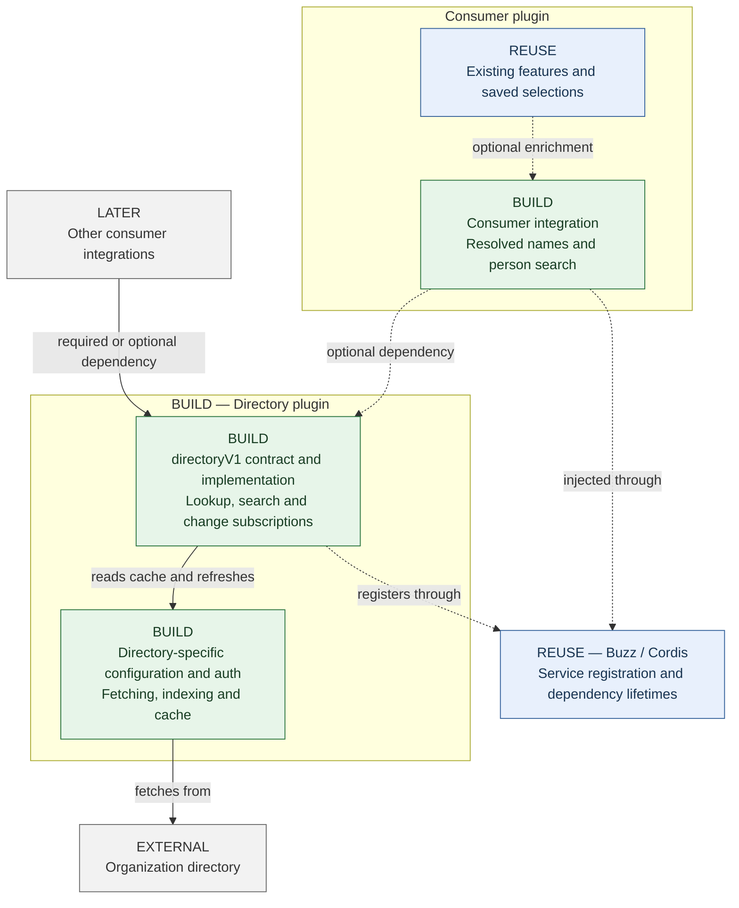

# Shared directory service

Status: Draft v0.1 — seeking direction feedback, not line edits.

## Problem

Plugins that display owners, select assignees or address messages need to:

- **Resolve identity:** turn an external account into a person and display name.
- **Discover people:** search for someone and obtain an account usable by the plugin.

Each plugin should not need its own directory credentials, fetching and cache.
Buzz’s Nostr profile and naming services do not provide organizational person
search or external-account mappings.

## Chosen approach

A replaceable Directory plugin provides `directoryV1` and owns configuration,
authentication, fetching and caching. Consumers keep their features and saved
selections. Optional consumers retain existing names and inputs without Directory;
required consumers depend on its service registration.

Start with an **experimental provider/consumer pair and provider-owned types**.
Stabilize the shared API after a second real consumer demonstrates reuse, or an
explicit product decision establishes another concrete need for that contract.
No stable Buzz-owned API is proposed.

**Build the provider and first consumer integration. Extract no built-in Buzz
service.** This PR proposes the design only. Organization charts, directory writes,
multiple simultaneous providers, Nostr naming changes and resolving Buzz recipients
for notifications or mentions are out of scope.

Diagram labels: **BUILD** = new code; **REUSE** = existing owner; **EXTERNAL** =
existing data source outside this project; **LATER** = outside the first delivery.


```mermaid
flowchart TB
  source["EXTERNAL<br/>Organization directory"]

  subgraph provider["BUILD — Directory plugin"]
    providerData["BUILD<br/>Directory-specific configuration and auth<br/>Fetching, indexing and cache"]
    service["BUILD<br/>directoryV1 contract and implementation<br/>Lookup, search and change subscriptions"]
    service -->|reads cache and refreshes| providerData
  end
  providerData -->|fetches from| source

  subgraph consumerPlugin["Consumer plugin"]
    core["REUSE<br/>Existing features and saved selections"]
    enrichment["BUILD<br/>Consumer integration<br/>Resolved names and person search"]
    core -.->|optional enrichment| enrichment
  end
  enrichment -.->|optional dependency| service
  consumers["LATER<br/>Other consumer integrations"] -->|required or optional dependency| service
  runtime["REUSE — Buzz / Cordis<br/>Service registration and dependency lifetimes"]
  service -.->|registers through| runtime
  enrichment -.->|injected through| runtime

  classDef build fill:#e7f5e9,stroke:#28733d,color:#183d23
  classDef reuse fill:#e8f0fc,stroke:#315f99,color:#183451
  classDef outside fill:#f2f2f2,stroke:#666,color:#333
  class providerData,service,enrichment build
  class core,runtime reuse
  class source,consumers outside
```

| Area | Work and ownership |
| --- | --- |
| Directory | Build the shared API, person index, cache, packaged source settings, credential-command integration and status/refresh card. |
| Consumers | Build lookup/search integration and cleanup; retain feature state, saved selections and fallback inputs. Add other consumers as needed. |
| Buzz infrastructure | Reuse [runtime/Cordis](../src/plugins/runtime.ts), plugin installation and [settings-card registration](../src/features/settings/service.ts). No new registry, credential store or HTTP subsystem. |
| Nostr identities | Retain the [profile directory](../src/features/relay/profile-directory.ts) and [identity-naming service](../src/features/identity-names/service.ts); neither becomes `directoryV1`. |
| Organization directory | Connect to an existing source; do not build a directory server. |

Migrating a consumer’s local directory code is separate from extracting Buzz
services. [Identity Naming](../src/bundled/identity-naming/index.ts) remains a Nostr
naming-policy plugin.

## Service contract [deep]

**The synchronous API is provisional.** Resolve source feasibility and latency
in questions 2–3 before agreeing or implementing it. A query-only source may
require an asynchronous API.

```ts
export type DirectoryPerson = Readonly<{
  id: string;
  displayName: string;
  accounts: Readonly<Record<string, string>>;
}>;

export type DirectoryStatus = Readonly<{
  state: "unconfigured" | "loading" | "ready" | "failed";
  failure?: string;
  loadedAt?: number;
}>;

export interface DirectoryV1 {
  lookup(namespace: string, account: string): DirectoryPerson | undefined;
  search(
    query: string,
    limit: number,
    namespace?: string,
  ): readonly DirectoryPerson[];
  status(): DirectoryStatus;
  refresh(): Promise<void>;
  snapshot(): number;
  subscribe(listener: () => void): () => void;
}
```

**Identity.** `id` is an opaque key for transient lists/selections, scoped to the
provider and authorization context: Buzz profile, directory account and source
configuration. Replacement may change it. Names are presentation only. Consumers
choose the account relevant to their action and persist that account in their
existing format, never a person ID or display name.

**Accounts.** Namespaces identify authority and identifier kind. V1 starts with
`github.com/login`; this limits initial support, not the service’s responsibility.
GitHub Enterprise is a separate authority. New namespaces need an explicit
contract addition. Return names/logins as supplied; compare GitHub logins
case-insensitively for lookup and before adding saved selections.

| Operation | Contract |
| --- | --- |
| `lookup` | Constant-time indexed read. Missing, conflicting or unknown-namespace mappings return no match. No batch method. |
| `search` | Trim queries; match names/logins case-insensitively. Empty query → no results. Stable order for the same query, namespace and snapshot. |
| Namespace filter | Keep only unambiguous accounts in that namespace **before** limiting results. Unknown namespace → no results. Omitted filter → all matching people, including those without usable accounts; consumers decide selectability. Making the filter required later breaks v1. |
| Result limit | An upper bound. Initially clamp positive integers to 20; invalid limits throw `RangeError`. No debounce initially; measure latency first. |
| Snapshot reads | Lookup/search never fetch. Read the current snapshot during loading or failure; retain prior successful data, or empty data before first success. Status does not gate reads. |
| Change notification | `snapshot()` stays stable until data/status changes. `subscribe` notifies afterward and returns an unsubscribe function. |
| Status | `loadedAt` is the last successful load in epoch milliseconds, absent before success. `failure` is sanitized text, never raw responses or credentials. Publish the service before fetching so loading does not delay activation. |

The service name versions the contract: v2-only providers cannot satisfy v1
consumers. After stabilization, breaking changes require a new name and continued
v1 support during migration; plugin `apiVersion: 1` does not negotiate services. Distribute shared
types, not provider implementation, through Directory’s authoring files by
default; confirm the location in question 1.

## Dependencies and replacement [deep]

Optional consumers use a child scope; their other required services remain:

```ts
export const inject = ["react", "pages"];
export function apply(ctx: Context) {
  registerPluginPage(ctx);
  ctx.inject(["directoryV1"], (scope) => {
    attachDirectory(scope, scope.directoryV1);
  });
}
```

`attachDirectory` subscribes and uses `scope.effect` cleanup to unsubscribe and
clear directory-derived UI. Parent requests, feature state and saved selections
remain active. The child starts when Directory appears, without remounting the
parent; synchronous reads need no asynchronous consumer lookup lifecycle.

Required consumers declare `directoryV1` in top-level `inject`. All entries are
required in pinned Cordis; object values configure interception, not optionality.
Registration permits activation **before data is ready**. No required consumer
ships in the first delivery.

| Directory condition | Optional consumer | Required consumer |
| --- | --- | --- |
| Absent, disabled, incompatible or activation failed | Existing names/inputs; no persistent directory error. | Wait for registration; timeout behavior below. |
| Unconfigured | Fallback; status belongs to Directory settings. | Direct users to settings; unresolved-person actions unavailable. |
| Initial load / initial failure | Fallback; Directory shows loading or offers retry. | Show loading or retry; unresolved-person actions unavailable. |
| Ready | Resolved names and person search. | Use results; unrelated operations remain the consumer’s responsibility. |
| Refresh loading / failed with cache | Keep cached results in the same authorization context; show failure/freshness without blocking existing features. | Same cached-data behavior. |
| Disabled or replaced after use | Clear derived UI; preserve features/selections. | Return to `starting`; timeout may require retry. |

For replacement in Settings → Plugins, disable the old provider, then enable the
new one. Only one `directoryV1` is registered at a time; its scope owns the
registration. Settings does not expose disposal completion. Old cleanup or
in-flight host work may overlap startup under another plugin ID; discard late
results as specified below. Duplicate registration fails while the existing
provider keeps serving. After disabling the old provider, retry the failed one
with disable/enable or reload. Cold-start registration order is unspecified.

A required consumer missing its service fails after the current **10-second
activation timeout**. Recovery then needs explicit disable/enable or reload;
restoring Directory alone is insufficient.

## Source, credentials and cache [deep]

Reuse the installed-desktop-plugin capabilities already declared by
[PluginManifest](https://github.com/block/buzz-app/blob/14a2e7ed585b130315629ded39d1b83b05eb2a53/src/plugins/api.ts)
and exposed through the [host service](https://github.com/block/buzz-app/blob/14a2e7ed585b130315629ded39d1b83b05eb2a53/src/features/host/service.ts).
These source links pin the public `main` revision checked on 2026-09-29.
Browser transport is unavailable through this capability and is not added here.

**Credentials and configuration**

1. Package non-secret source URL/options with the provider; declare HTTPS origins
   and the credential command in its manifest.
2. On activation, call `ctx.host.runCommand(commandId)`. Validate output and account
   identity before using `ctx.host.request` for declared-origin requests.
3. Keep credentials in provider memory; never preferences, browser storage, logs
   or `DirectoryV1`. The external tool manages its own login/session.
4. Command failure or expiry produces sanitized failure status. Explicit retry
   reacquires credentials; an account change clears the old snapshot first.
   Disposal clears credentials.

Source-setting changes require a provider update/reload. The first settings card
offers status and refresh/retry, not persistent editing. Buzz’s settings cards
store no configuration or credentials; this approach needs no new store and uses
no consumer token. Plugins are trusted same-process code; injection is not access
control. Escape display names; never authorize actions from names or mappings.

**Fetch and cache rules**

| Concern | Decision |
| --- | --- |
| Host limits | Reuse the [30-second request deadline and 16 MiB UTF-8 response cap](https://github.com/block/buzz-app/blob/14a2e7ed585b130315629ded39d1b83b05eb2a53/src-tauri/src/host_request.rs). No second timeout policy. Per-request limits do not bound a paginated refresh; question 3 must establish total bounds and supported size. Pagination is not assumed. |
| Trigger / freshness | Fetch on configuration/activation; later refreshes and retries are manual. No timer. Settings labels `loadedAt` age over 24 hours stale; age alone neither evicts data nor fetches. |
| Shared refresh | Concurrent calls share one request. Expected failures update status and settle `refresh()` without rejection; subscribers observe status. Success replaces the snapshot, including empty success. Failure retains data only in the same authorization context. |
| Isolation / invalidation | Scope cache to profile/account/source. Disposal, reload, credential replacement or scope change clears it and increments a generation. Discard older responses; invalidated refreshes settle without publishing. Never reuse another account’s data. |
| Cancellation | Host requests have no caller cancellation; native work may finish or reach its deadline. No host cancellation API is proposed. |
| Consumer disconnect | Clear that consumer’s transient names/search on its own disconnect/account change; leave the shared provider cache for other consumers. |

Directory owns refresh/indexing and keeps records in memory, never host
preferences, relay events or consumer state. Its settings card shows refresh
result, load age, indexed-person count and omitted-conflict count. These reveal
failed loads, stale data and missing mappings without logging people or credentials.

## Example and edge cases [sketch]

A review plugin shows `lookup("github.com/login", authorLogin)`’s display label or
the GitHub login. The label may be a username; full names require a source that
provides them. One subscription updates names after refresh without refetching
GitHub. Its priority-account (VIP) picker calls
`search(query, 20, "github.com/login")`. At the cap, show “Refine your search”;
the API supplies no total for a numeric remainder. Unusable accounts do not occupy result
slots. The user selects a person; the plugin saves their GitHub login in its
existing list. Directory neither owns that list nor its meaning. Disabling it
preserves saved accounts and manual entry.

1. **Ambiguity vs conflict.** Show account logins when several people match;
   require explicit selection, never infer from a name. While indexing source
   rows—before constructing `accounts`—detect one account mapping to many people
   or one person mapping to multiple accounts in a namespace. V1 requires 1:1:
   omit those mappings from lookup/selectable search and count them in diagnostics.
   No public omission-count field initially.
2. **Disable/change credentials during refresh.** Clear affected cache/UI and
   invalidate late results. After replacement, subscribe only to the new provider.
   Existing queues, manual input and saved VIPs continue working.

## Delivery and verification [sketch]

1. Verify source/credential command and agree the experimental contract. Implement
   the provider, status/refresh UI, provider-owned types and first consumer together;
   no unused registry or alternate provider.
2. Deploy Directory before migrating the consumer. Remove local directory
   fetch/cache/configuration so only one implementation runs per plugin version;
   preserve feature settings and saved selections. Other consumers follow as needed.
3. Verify both in an authenticated desktop host, including fallback when disabled.
   Consumer rollback requires no saved-selection conversion.

| Planned check | Coverage |
| --- | --- |
| Provider unit tests | Conflicts; namespace filtering before cap; unfiltered people without accounts; unknown namespaces; empty data; command/initial/refresh failures; credential reacquisition/isolation and account changes; shared refresh; late results. |
| Consumer components | Explicit selection, preference preservation, fallback and clearing stale UI. |
| Host integration | Actual injection, duplicate-provider failure, enable/disable/replacement without restarting the consumer parent. Control request completion with deferred operations. |
| Desktop check | Authentication, configuration and person selection. |

Implementation and these checks are future work. Existing standalone assertions
against pinned Cordis verified provider appearance, disappearance, replacement and
shutdown while the consumer parent starts once. They validate dependency mechanics,
not the proposed API or authenticated provider.

## Alternatives and trade-offs

| Alternative | Why choose the proposal; accepted cost |
| --- | --- |
| Host-owned directory registry | Cordis already registers/disposes one provider. Consumers must manage child scopes and replace handles/subscriptions on provider changes. |
| Persisted snapshot | Memory avoids on-disk person records and cache migration/deletion. Every launch fetches again and shows fallback first; freshness applies within that session. |
| Multiple accounts per namespace | One account gives the first consumer an actionable result without another picker. V1 excludes legitimate multi-account mappings; lists later require a new contract version. |
| Unversioned service name | Versioned names protect independently released consumers. Breaking migration requires maintaining both contracts instead of silently changing existing behavior. |

## Open questions

Dates are decision deadlines, not delivery commitments.

| # | Decision needed | Owner | Deadline |
| --- | --- | --- | --- |
| 1 | Shared type distribution: default to Directory authoring files. Re-exporting from `@buzz/author` needs explicit FOUNDATION approval. | Buzz plugin API maintainer | 2026-10-02, before implementation |
| 2 | Select source URL, origins and credential command; verify output, account identity and token expiry against that source. | Directory maintainer | 2026-10-02, before implementation |
| 3 | Prove complete-snapshot feasibility: supported person count, transfer size, total load time/bound, pagination needs and search latency. Decide synchronous-API viability; revise the design first if it fails. | Directory maintainer | 2026-10-02, before contract agreement/implementation |
| 4 | Provider distribution/maintenance: default to an independently installed plugin; keep private configuration out of Buzz’s public catalog. | Directory maintainer | 2026-10-09, before rollout |

## Reversibility

| Decision | Classification | Cost of changing |
| --- | --- | --- |
| Provider-scoped IDs, authority-scoped accounts, existing storage formats | Costly to reverse | Coordinate consumers/providers; possible preference migration. |
| Versioned `directoryV1` contract | Costly to reverse | Breaking behavior requires a new version for independent consumers. |
| Plugin owns registration/configuration/fetch/cache | Reversible | Move ownership while preserving the API. |
| Optional child scope | Reversible | Consumer wiring change; required dependency loses fallback. |
| One active provider | Reversible | Multiple-provider selection needs another design. |
| Indexed lookup, 20-result cap, no debounce | Reversible | Tune internals/defaults after measurement; preserve the contract. |
| 24-hour freshness, manual retry, host deadline | Reversible | Provider owns cache policy; host owns request limits. |
| Memory cache and type-only authoring files | Reversible | Persistence/packaging each need compatibility review. |
| Packaged settings, command credentials in memory | Reversible | Later editing/storage changes the provider, not consumers. |
